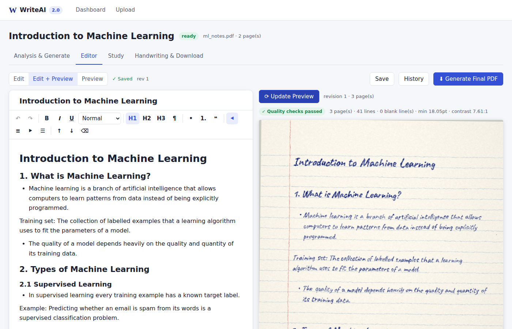
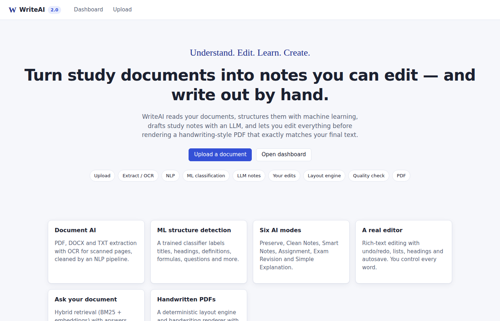
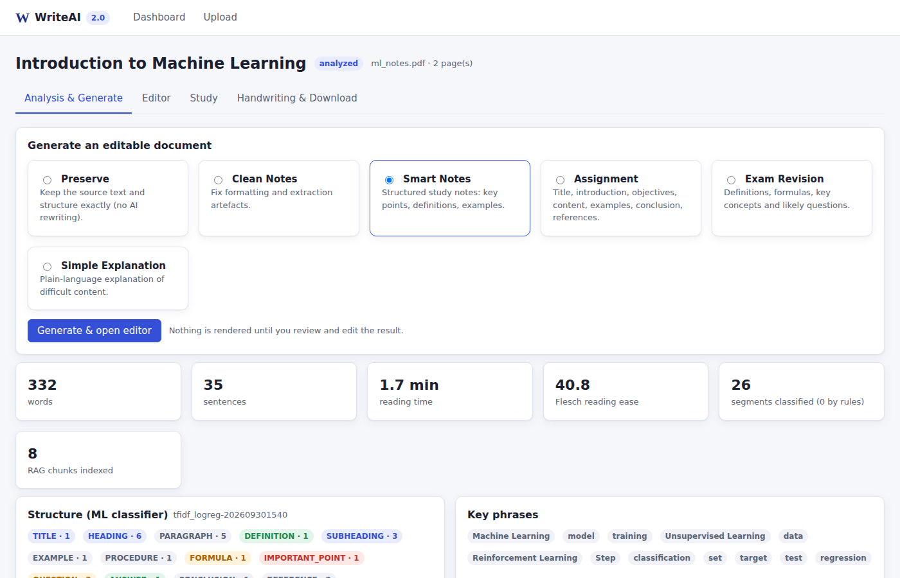
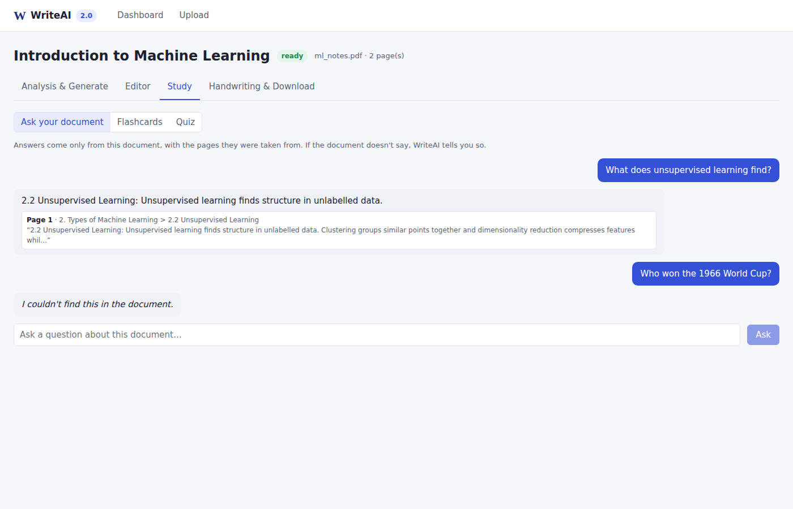
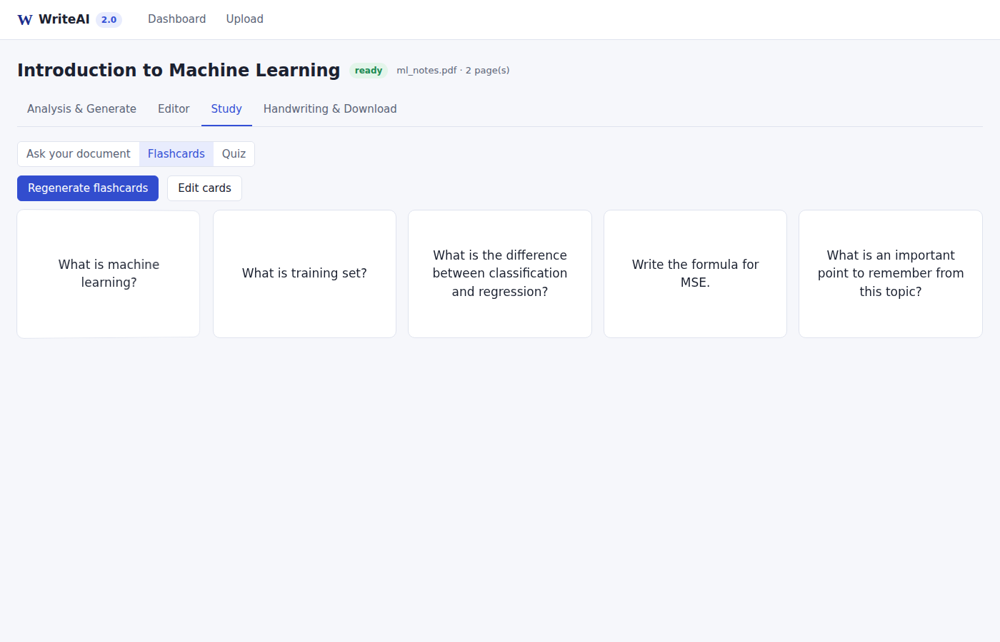
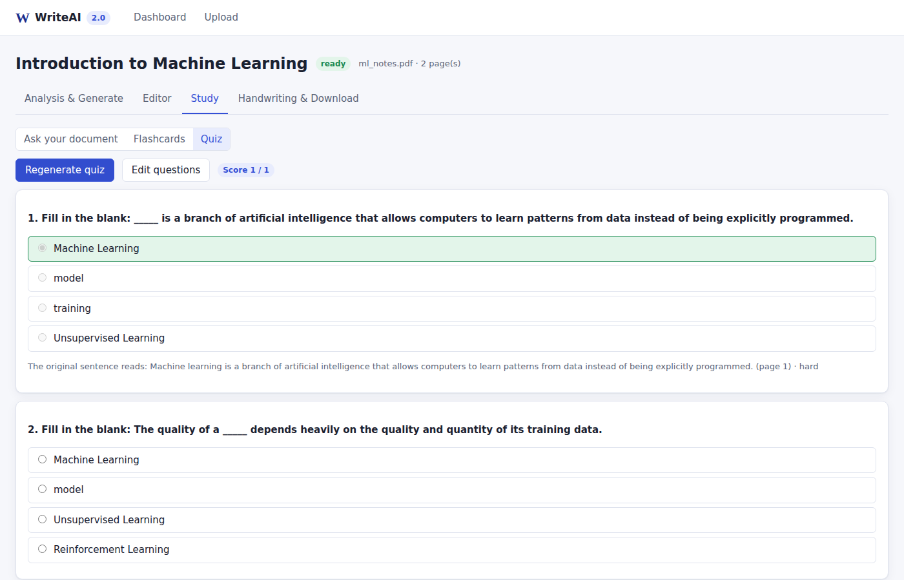
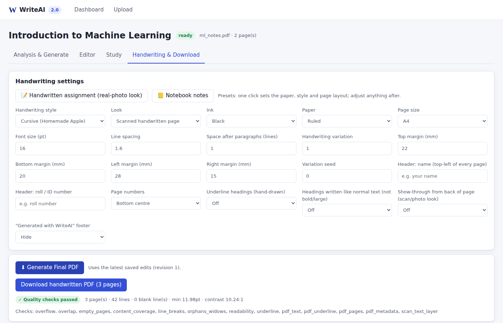
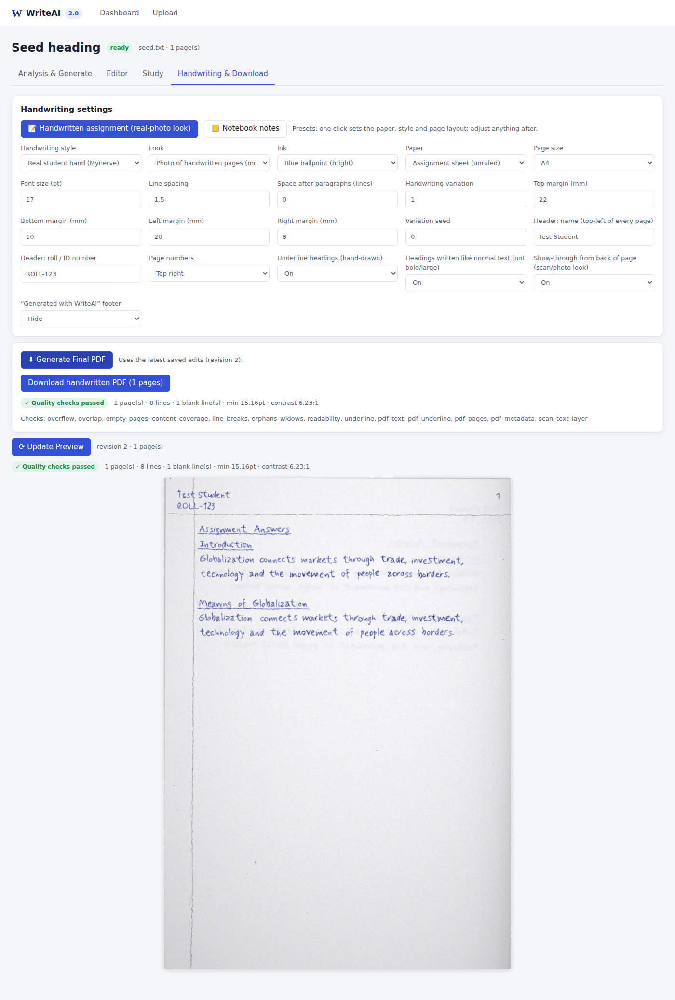
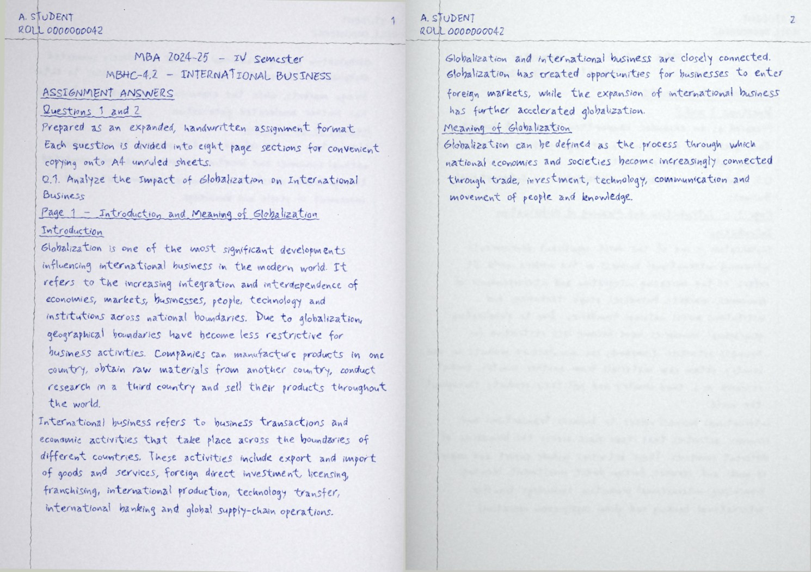

# WriteAI 2.0

**Understand. Edit. Learn. Create.**

AI-powered document intelligence that turns educational documents into **fully
editable** structured notes, study material (flashcards, quizzes,
Ask-Your-Document) and **handwriting-style PDFs that exactly match the edited
text**.



---

## Problem

Students collect PDFs, slides and notes, but turning them into good study
material is slow. The usual "AI notes" tools produce text you can't really
control, and "handwriting font" converters simply restyle whatever they are
given. Nothing guarantees that what you corrected is what gets written out.

## Solution

WriteAI is a genuine multi-stage system rather than an LLM wrapper:

```text
PDF / DOCX / TXT ─► Extraction + OCR ─► NLP preprocessing ─► ML section classifier
      ─► section tree ─► LLM (or offline engine) ─► validated structured document
      ─► ┌──────────────────────────────┐
         │  EDITABLE DOCUMENT (TipTap)  │  ◄── the user changes anything; autosave + versions
         └──────────────┬───────────────┘
                        ▼ (flush → revision-pinned)
      layout engine ─► handwriting renderer ─► quality checker ─► PDF (+ post-render audit)
```

The edited document is the **only** thing ever rendered. Every PDF carries the
content hash of the exact revision it came from.

## Features

* **Upload** PDF, DOCX or TXT with drag and drop. Scanned pages are OCR'd with
  OpenCV preprocessing and Tesseract.
* **Analysis:**
  - word, sentence, readability and reading-time statistics, keyphrases;
  - ML-labelled structure (13 classes) with confidence scores;
  - prompt-injection warnings.
* **Six AI modes:** Preserve, Clean Notes, Smart Notes, Assignment, Exam
  Revision, Simple Explanation.
* **Rich-text editor:**
  - undo/redo, bold/italic/underline, H1–H3, lists, quotes;
  - alignment, font size, move blocks, clear formatting;
  - full keyboard and clipboard support;
  - autosave ("✓ Saved" / "Saving…"), conflict handling, version history
    with compare and restore.
* **Underline is never automatic.** It appears only where you apply it; AI
  output and pasted web content can't bring it in.
* **Live preview**, with an Edit / Edit + Preview / Preview switch and an
  explicit "Update Preview".
* **Handwriting that looks scanned:**
  - by default each page looks like a real handwritten sheet run through a
    scanner (paper texture, lighting, slight tilt, soft ink, per-letter
    variation), with an invisible text layer so it stays searchable;
  - a clean digital look is also available;
  - 9 styles (including a "real student hand" modelled on a real
    handwritten assignment), blue, bright ballpoint blue or black ink,
    ruled/blank/grid/assignment paper;
  - **Handwritten assignment** preset (one click): looks like a phone photo of
    real handwritten sheets. Unruled paper with a header line and margin
    line; your name and roll/ID number on every page; page number top-right;
    plain, hand-underlined headings; every letter shaped slightly
    differently, lines that rise and a margin that drifts; uneven ballpoint
    ink and writing showing through from the back of the sheet;
  - size, line spacing, paragraph spacing and margins;
  - page numbers (bottom or top-right), variation amount and seed.
* **Quality gate:** overflow, ink overlap, empty pages, exact content
  coverage, blank lines and line breaks, orphan headings, readability and
  contrast, underline audit, and a post-render audit that reads the PDF back.
* **Study mode:**
  - Ask Your Document (hybrid RAG, cited pages, refuses when the answer isn't
    in the document);
  - editable flashcards;
  - editable quiz (4 options, answer, explanation, difficulty, pages).
* **Works without an API key:** a deterministic offline engine covers every
  AI feature. Add `ANTHROPIC_API_KEY` to use Claude.

## Architecture

See **[docs/architecture.md](docs/architecture.md)** (as built) and
**[docs/design.md](docs/design.md)** (the up-front design).

| Layer | Tech |
|---|---|
| Frontend | React 19, Vite, plain CSS (no Tailwind), TipTap 3 / ProseMirror, React Router |
| API | Python 3.11, FastAPI, Pydantic v2, SQLAlchemy 2 (SQLite, or PostgreSQL) |
| Document AI | PyMuPDF, python-docx, Tesseract + OpenCV |
| NLP | spaCy, YAKE, custom cleanup/segmentation, Flesch readability |
| ML | scikit-learn (TF-IDF + layout → Logistic Regression; SVM and dense comparisons) |
| LLM | Anthropic Claude via the official SDK (structured outputs), with an offline extractive engine |
| RAG | Structure-aware chunking, MiniLM or hashing embeddings, ChromaDB, BM25, Reciprocal Rank Fusion |
| Rendering | Custom layout engine, ReportLab (vector PDF), PyMuPDF (preview/audit), OFL/Apache handwriting fonts |
| Testing | pytest, Hypothesis, Vitest, fast-check, Playwright |
| Deploy | Docker, docker compose, nginx, GitHub Actions |

## AI, ML and NLP pipelines

* **[NLP pipeline](docs/nlp-pipeline.md):**
  - typography-preserving extraction and OCR;
  - header/footer removal;
  - de-hyphenation;
  - line merging with adaptive paragraph gaps.
* **[ML pipeline](docs/ml-pipeline.md):** a 13-class section classifier.
  Training data is generated and then extracted with the production pipeline.
  Splits are by subject, and a hand-written gold set is kept separate.
* **[LLM design](docs/llm-design.md):**
  - structured outputs and semantic validation;
  - repair, then fallback;
  - a converter that can't emit formatting;
  - map-reduce for long documents.
* **[RAG](docs/rag.md):**
  - hybrid retrieval and a relevance gate;
  - citation validation, with pages resolved server-side.

## Editable document & rendering

* **[Editor architecture](docs/editor-architecture.md):**
  - closed schema;
  - WDM ⇄ TipTap converters (property-tested);
  - autosave state machine and versions.
* **[Handwriting engine](docs/handwriting-engine.md):** bounded, seeded,
  per-block-stable variation.
* **[Layout engine](docs/layout-engine.md):**
  - line grid;
  - ink-level collision avoidance;
  - keep-with-next with backtracking;
  - widow and orphan control.

## Dataset & model evaluation (measured)

| Classifier (selected: TF-IDF + layout → LR) | n | Accuracy | Macro-F1 |
|---|---|---|---|
| Synthetic documents, held-out subjects | 3,442 | 0.995 | 0.997 |
| **Hand-written gold set** | 140 | **0.929** | **0.933** |

| RAG (24 questions, hashing embedder, offline answerer) | |
|---|---|
| Recall@5 / MRR | 1.00 / 0.947 |
| Unanswerable questions refused | 5 / 5 |

The synthetic score is optimistic because the generator's templates are
shared across splits; the gold score is the honest estimate. Details and
limitations: **[docs/evaluation.md](docs/evaluation.md)**.

## Screenshots

| | |
|---|---|
|  |  |
|  |  |
|  |  |
|  |  |

The screenshots are captured automatically by the Playwright tests
(`frontend/e2e/study-and-pages.spec.js`, `assignment-sheet.spec.js`).

**Demo video:** not recorded yet. For a live walkthrough, run the app and
follow the acceptance flow below.

## Installation

### Fastest: GitHub Codespaces (runs in your browser)

On the GitHub repo page: **Code → Codespaces → Create codespace on this branch**.
The dev container installs everything (`scripts/setup.sh`, about 2–4 minutes on
first start), starts the API and web UI (`scripts/dev.sh`), and opens the app in
a new browser tab. To use Claude, add `ANTHROPIC_API_KEY` to `.env` in the
Codespace (or as a Codespaces secret) and run `scripts/dev.sh` again.

### Windows (PowerShell)

Install [Git](https://git-scm.com/download/win), [Python 3.11+](https://www.python.org/downloads/)
(tick "Add python.exe to PATH") and [Node.js 22 LTS](https://nodejs.org/), then:

```powershell
cd $HOME
git clone https://github.com/LokareGouthami2/AI
cd AI
git checkout claude/writeai-2-0-platform-3ch69p
powershell -ExecutionPolicy Bypass -File scripts\setup.ps1   # once
powershell -ExecutionPolicy Bypass -File scripts\dev.ps1     # starts and opens http://localhost:5173
```

### One command locally (Linux/macOS)

```bash
scripts/setup.sh   # once: venv, deps, spaCy model, frontend packages, .env
scripts/dev.sh     # start → http://localhost:5173  (stop: scripts/dev.sh stop)
```

### Local development (manual)

```bash
# Backend (Python 3.11)
python -m venv .venv && . .venv/bin/activate
pip install -r requirements-dev.txt
python -m spacy download en_core_web_sm
sudo apt-get install tesseract-ocr          # for scanned PDFs (optional)
uvicorn backend.main:app --reload           # http://127.0.0.1:8000/api/docs

# Frontend (Node 22)
cd frontend && npm install && npm run dev   # http://localhost:5173 (proxies /api)
```

Optional: `pip install -r requirements-embeddings.txt` for MiniLM embeddings.

### Docker

```bash
cp .env.example .env
docker compose up --build        # http://localhost:8080
```

### Re-train and re-evaluate

```bash
python -m backend.ml.train --docs 40 --regenerate
python -m backend.rag.evaluate
```

### Tests

```bash
pytest                                   # backend: 122 tests
cd frontend && npm test                  # frontend unit: 34 tests
cd frontend && npx playwright test       # browser e2e: 13 tests incl. the critical acceptance test
```

## Environment variables

See **[.env.example](.env.example)**. Key ones:

| Variable | Default | Purpose |
|---|---|---|
| `ANTHROPIC_API_KEY` | — | Enables Claude (server-side only) |
| `WRITEAI_LLM_PROVIDER` | `auto` | `auto` \| `anthropic` \| `mock` (offline engine) |
| `WRITEAI_ANTHROPIC_MODEL` | `claude-opus-5-5` | Model id |
| `WRITEAI_ANTHROPIC_EFFORT` | `medium` | Effort level |
| `WRITEAI_EMBEDDING_BACKEND` | `auto` | MiniLM if cached, else hashing |
| `WRITEAI_DATA_DIR` | `./data` | DB, uploads, renders, vectors |
| `WRITEAI_DATABASE_URL` | SQLite | e.g. PostgreSQL |
| `WRITEAI_MAX_UPLOAD_MB` / `WRITEAI_MAX_PAGES` | 20 / 300 | Upload limits |
| `WRITEAI_API_TOKEN` | — | Optional shared token for demos |

## API

Interactive docs are at `/api/docs` (OpenAPI).

| Method | Path | Purpose |
|---|---|---|
| POST | `/api/documents/upload` | Validate and store a file |
| POST | `/api/documents/{id}/extract` | Text / OCR extraction (job) |
| POST | `/api/documents/{id}/analyze` | NLP + ML + RAG index (job) |
| GET | `/api/documents/{id}/analysis` | Stats + labelled segments |
| POST | `/api/documents/{id}/generate` | AI mode → editable document (job) |
| GET | `/api/documents/{id}/content` | Current head (revision, hash, WDM) |
| **PUT** | **`/api/documents/{id}/content`** | **Save the edited document (optimistic concurrency)** |
| GET/POST | `/api/documents/{id}/versions[/{n}[/restore]]` | Version history |
| POST | `/api/documents/{id}/preview` | Revision-pinned handwritten preview |
| POST | `/api/documents/{id}/validate` | Quality check only |
| POST | `/api/documents/{id}/render` | Final PDF (job) |
| GET | `/api/documents/{id}/download` | Latest final PDF (refuses stale renders) |
| POST | `/api/documents/{id}/ask` | Grounded Q&A with citations |
| POST/PUT | `/api/documents/{id}/flashcards[/{set}]` | Generate / save edited flashcards |
| POST/PUT | `/api/documents/{id}/quiz[/{quiz}]` | Generate / save edited quiz |
| GET/PUT | `/api/documents/{id}/render-settings` | Handwriting settings |
| DELETE | `/api/documents/{id}` | Delete everything for a document |
| GET | `/api/jobs/{id}` | Background job status |

## Critical acceptance test

The requirement's 14-step test (upload → Smart Notes → delete a paragraph →
Enter twice → new paragraph → heading → modify sentences → undo → redo →
save → preview → PDF → verify) is automated in a real browser in
`frontend/e2e/acceptance.spec.js`, and at API level in
`backend/tests/test_acceptance.py`. **Both pass.**

## Limitations

* **No live LLM calls were made while building.** There was no API key in the
  build environment. The Claude integration follows the current SDK and is
  unit-tested with scripted responses; everything end to end ran on the
  offline engine.
* **Classifier training data is generated.** The gold set is small (140
  segments), and public corpora were unreachable here.
* **MiniLM embeddings weren't available** (Hugging Face was blocked), so the
  hashing embedder is lexical.
* **Handwriting uses fonts plus procedural variation**, not a learned
  handwriting model.
* **v1 is single-user** (no auth beyond an optional token), with an
  in-process job runner and SQLite.
* **E2E tests run in Chromium only.**

## Ethical considerations

WriteAI is meant for **personal study notes**. An optional "Generated with
WriteAI" footer can be switched on in the handwriting settings. Handing in
computer-generated "handwriting" as your own work may violate
academic-integrity rules.
AI-generated notes can be wrong, which is why everything is editable and
answers cite their source pages. Document text is sent to the configured LLM
provider only when an AI mode is used with an API key; Preserve mode and the
offline engine run entirely locally.

## Future improvements

- Alembic migrations;
- PostgreSQL + a job queue for multi-user deployments;
- authentication;
- MiniLM / cross-encoder reranking;
- a live-LLM evaluation harness;
- a larger human-annotated dataset;
- real-scan OCR benchmarks;
- learned handwriting synthesis;
- collaborative editing;
- Firefox/WebKit e2e;
- a recorded demo video.

## Project structure

```text
backend/   api/ services/ schemas/ models/ database/ documents/ nlp/ ml/ llm/ rag/
           editor/ layout/ handwriting/ pdf/ quality/ assets/fonts/ tests/
frontend/  src/{pages,components,editor,preview,study,services,styles,__tests__} e2e/
ml_models/ trained classifier + metrics.json + confusion matrices + rag_metrics.json
datasets/  splits/ (document ids per split), annotations/ (guidelines)
docs/      design, architecture, ml/nlp/llm/rag, editor, handwriting, layout, evaluation, security, deployment, interview questions
docker/    Dockerfiles + nginx.conf     .github/workflows/ci.yml
```
